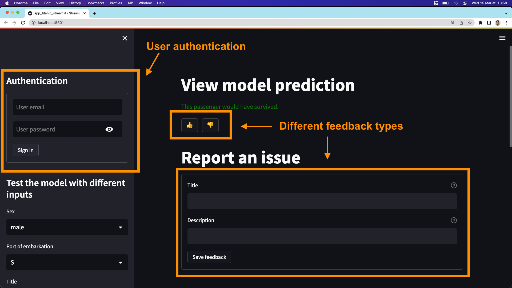

# Welcome to the trubrics-sdk
-------

<center>


[trubrics.com](https://www.trubrics.com/home)

*Investigate models, collaborate across teams, validate machine learning.*
</center>

-------

The trubrics-sdk is a python library for validating machine learning with data science and domain expertise. This is achieved by collecting business user feedback, creating actionable validation points by combining the feedback with data science knowledge, and building repeatable validation checklists - a trubric.

## Key Features
- Python web development components (e.g. with [Streamlit](https://streamlit.io/)) to gather feedback from business users on models with the **trubrics FeedbackCollector**.
- Out of the box & custom validations (python functions) to build around models & datasets with the **trubrics ModelValidator** (currently supporting tabular data).
- **Trubrics CLI** tool to run a list of saved validations (a **trubric**) against new models or datasets in a CI/CD/CT pipeline.
<center>


</center>

## Install (Python 3.7+)
```console
(venv)$ pip install trubrics
```

## Validate a model with the ModelValidator
There are three basic steps to creating model validations with the trubrics-sdk:

1. Initialise a `DataContext`, that wraps ML datasets and metadata into a trubrics friendly object. This step is also relevant for building a user feedback application with the [FeedbackCollector](#collect-user-feedback-with-the-feedbackcollector).
2. Feed the `DataContext` and an ML model (scikit-learn or [any other model](https://trubrics.github.io/trubrics-sdk/models/)) into the `ModelValidator`, that holds a number of [out-of-the-box validations](https://trubrics.github.io/trubrics-sdk/validations/) and can also be used to build [custom validations](https://trubrics.github.io/trubrics-sdk/custom_validations/).
3. Group the list of validations created into a `Trubric`, that can then be saved to a local .json file.

Try out these steps by creating your own Trubric with this example:
```py
from trubrics.context import DataContext
from trubrics.example import get_titanic_data_and_model
from trubrics.validations import ModelValidator, Trubric

_, test_df, model = get_titanic_data_and_model()

data_context = DataContext(
    testing_data=test_df,  # pandas dataframe of data to validate model on
    target="Survived",
)

model_validator = ModelValidator(data=data_context, model=model)
validations = [
    model_validator.validate_performance_against_threshold(metric="accuracy", threshold=0.7),
    model_validator.validate_feature_in_top_n_important_features(feature="Age", top_n_features=3),
]
trubric = Trubric(
    name="my_first_trubric",
    data_context_name=data_context.name,
    data_context_version=data_context.version,
    validations=validations,
)
trubric.save_local(path=".")
```

The trubric defines the gold standard of validations required for the project, and may be used to validate any combination of model and `DataContext`. Once saved as a .json, the trubric may be run directly with a [CLI](https://trubrics.github.io/trubrics-sdk/run_trubrics/).

*See a full tutorial on the titanic dataset [here](https://trubrics.github.io/trubrics-sdk/notebooks/titanic-demo.html)*.

## Collect user feedback with the FeedbackCollector
Trubrics feedback components help you build python applications with your favourite library (e.g. [Streamlit](https://streamlit.io/)).
These are aimed at collecting feedback on your models from business users and translating these into validation points.

As with the ModelValidator, the `DataContext` is initialised and fed into the `FeedbackCollector`:
```python
import streamlit as st
from trubrics.example import get_titanic_data_and_model
from trubrics.context import DataContext
from trubrics.feedback import FeedbackCollector

train_df, test_df, model = get_titanic_data_and_model()
data_context = DataContext(
    testing_data=test_df,
    training_data=train_df,
    target="Survived",
    categorical_columns=["Sex", "Embarked", "Title"],  # for the FeedbackCollector, categorical columns must be specified in the DataContext
)

collector = FeedbackCollector(data=data_context, model=model)
```

The FeedbackCollector includes various methods to facilitate building an application with streamlit:

- **What-if experimentation**: generate a series of user inputs from the testing_data of the `DataContext`
    ```python
    with st.sidebar:
        st.title("Modify features to test the model...")
        collector.generate_what_if()
    ```

- **Feedback collection**: save various feedback types to a local .json file
    ```python
    st.title("View model prediction")
    st.text(collector.what_if_prediction)

    st.title("Send model feedback")
    collector.save_feedback(path=".", file_name="feedback.json")
    ```

*Run our demo user feedback app on the titanic dataset & model with the cli command:*
```console
(venv)$ trubrics example-titanic-app
```

