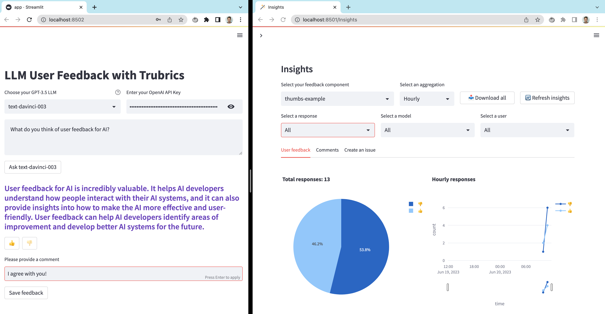

# Welcome to the trubrics-sdk
<center>

[](https://discord.gg/jJ9YDE7qmt)
[](https://trubrics.github.io/trubrics-sdk/)

</center>

<center>

[](https://github.com/trubrics/trubrics-sdk/actions/workflows/test.yml)
[](https://github.com/trubrics/trubrics-sdk/actions/workflows/docs.yml)
[](https://github.com/trubrics/trubrics-sdk/releases)
[](https://github.com/trubrics/trubrics-sdk/blob/main/LICENSE)

</center>

Trubrics enables AI teams to **collect, analyse and manage user prompts & feedback** on models. This allows teams to:

- **🚨 Identify bugs** - users are constantly running inference on models, and may be more likely to find bugs than an ML monitoring system
- **🧑‍💻️ Fine tune** - users often hold domain knowledge that can be useful to fine tune models
- **👥 Align** - identifying user preferences will help to align models to users



## Try our LLM demo

1. Create your **free account**:

    [](https://trubrics.streamlit.app/)

2. Save feedback to Trubrics from our **demo LLM app**:

    [](https://trubrics-llm-example-chatbot.streamlit.app/)

Or watch a step by step video of integrating Trubrics into the LLM Streamlit app [here](https://www.youtube.com/watch?v=2Qt54qGwIdQ).

## Collect user prompts & feedback with the Python SDK

The python SDK allows you to collect user prompts & feedback from your ML apps from any python backend or web framework. Install it with:

```console
pip install trubrics
```

Now set your [Trubrics](https://trubrics.streamlit.app/) `email` and `password` as environment variables:

```bash
export TRUBRICS_EMAIL="trubrics_email"
export TRUBRICS_PASSWORD="trubrics_password"
```

and push some user prompts & feedback to the `default` project & feedback component:

```python
import os
from trubrics import Trubrics

trubrics = Trubrics(
    project="default",
    email=os.environ["TRUBRICS_EMAIL"],
    password=os.environ["TRUBRICS_PASSWORD"],
)

user_prompt = trubrics.log_prompt(
    config_model={"model": "gpt-3.5-turbo"},
    prompt="Tell me a joke",
    generation="Why did the chicken cross the road? To get to the other side.",
)

user_feedback = trubrics.log_feedback(
    component="default",
    model=user_prompt.config_model.model,
    prompt_id=user_prompt.id,
    user_response={
        "type": "thumbs",
        "score": "👎",
        "text": "Not a very funny joke...",
    }
)
```

## Collect user prompts & feedback from a Streamlit app

To start collecting user feedback from your [Streamlit](https://streamlit.io/) app, install the additional dependency:

```console
pip install "trubrics[streamlit]"
```

and test this code snippet in your app:

```python
import streamlit as st
from trubrics.integrations.streamlit import FeedbackCollector

collector = FeedbackCollector(
    email=st.secrets.TRUBRICS_EMAIL,
    password=st.secrets.TRUBRICS_PASSWORD,
    project="default"
)

user_feedback = collector.st_feedback(
    component="default",
    feedback_type="thumbs",
    open_feedback_label="[Optional] Provide additional feedback",
    model="gpt-3.5-turbo",
    prompt_id=None,  # checkout collector.log_prompt() to log your user prompts
)

if user_feedback:
    st.write("#### Raw feedback saved to Trubrics:")
    st.write(user_feedback)
```

For a full examples logging user prompts and feedback in Streamlit, see our [Streamlit integration docs](https://trubrics.github.io/trubrics-sdk/integrations/streamlit/).

## Collect user feedback from a React.js app

To collect user feedback from a React application, check out [this example](https://github.com/trubrics/trubrics-sdk/tree/main/examples/react_js).

## What's next?

- If you haven't already, create a free account or sign in to [Trubrics](https://trubrics.streamlit.app/).
- Get more technical information from our [docs](https://trubrics.github.io/trubrics-sdk/):
    - Collect & analyse [user prompts](https://trubrics.github.io/trubrics-sdk/platform/user_prompts/)
    - Collect & analyse [user feedback](https://trubrics.github.io/trubrics-sdk/platform/user_feedback/)
    - Manage user feedback with [Issues](https://trubrics.github.io/trubrics-sdk/platform/issues/)
- Check out our [website](https://www.trubrics.com/home) for more information about Trubrics.
