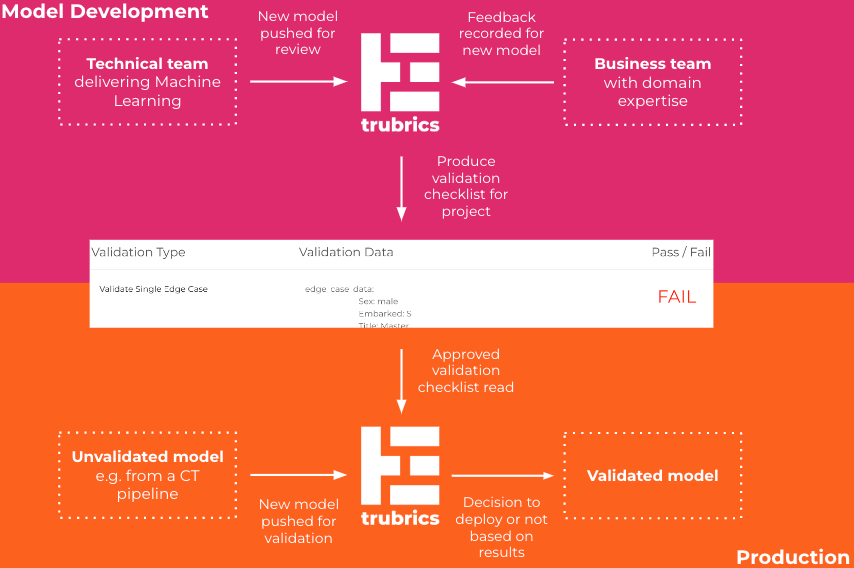

# Welcome to the trubrics-sdk
<center>


*Combine data science knowledge with business user feedback to validate machine learning.*

[Technical docs](https://trubrics.github.io/trubrics-sdk/) | [Website](https://www.trubrics.com/home)
</center>

Trubrics bridges the gap between data scientists understanding of business challenges, and business users understanding of data science outputs. The trubrics-sdk is a python library to collect business user feedback for machine learning, combine feedback with data science knowledge into actionable validation points, and build repeatable validation checklists - a trubric.

<center>


</center>

## Key Features
- Out of the box validations to build around models & datasets (currently supporting tabular data)
- An object to write custom validations
- A CLI tool to run validations against new models in a CI/CD/CT pipeline
- Python web development components (e.g. with [Streamlit](https://streamlit.io/)) to gather feedback from business users on models
- A UI to track validation checklists per project - coming soon

## Install (Python 3.7+)
```console
(venv)$ pip install trubrics
```

## Create a trubric
A trubric is a checklist of validations, and can be built by:

1. Initialising `DataContext` and `ModelContext` objects to wrap data and models into a trubrics friendly format
```py
from trubrics.context import DataContext, ModelContext
from sklearn.metrics import accuracy_score
data_context = DataContext(
    testing_data=test_df,  # pandas dataframe of data to test against a model
    target_column="target_column_name_in_test_df"
)

model_context = ModelContext(
    estimator=model,  # model to validate
    evaluation_function=accuracy_score  # evaluation function
)
```

2. Using the `Validator` object to generate out of the box validations
```py
from trubrics.validators.base import Validator
model_validator = Validator(data=data_context, model=model_context)
validations = [
    model_validator.validate_performance_against_threshold(threshold=0.8),
    model_validator.validate_biased_performance_across_category(
        category="feature_a", threshold=0.05
    )
]
```

3. Saving a .json of all validations locally using a `TrubricsContext` object
```py
from trubrics.context import TrubricContext
trubric_context = TrubricContext(
    name="my_first_trubric",
    model_context_name=model_context.name,
    model_context_version=model_context.version,
    data_context_name=data_context.name,
    data_context_version=data_context.version,
    validations=validations,  # list of ValidationContexts
)
trubric_context.save_local(path="/data")
```

## Run a trubric
Run the locally saved trubric .json with:
```console
(venv)$ trubrics run <trubrics_config_file>.py
```

`<trubrics_config_file>.py` is a trubrics config file where you can initialise a `DataContext` and `ModelContext`.
The file must contain a variable RUN_CONTEXT, an instance of the TrubricRun class. See an example of this file in
[examples/trubrics_config.py](examples/trubrics_config.py).

## Collect model feedback
Trubrics feedback components help you build python applications with your favourite library (e.g. [Streamlit](https://streamlit.io/)).
These are aimed at collecting feedback on your models from business users and translating these into validation points.
Build a feedback application by:

1. As with [Create a Trubric](#create-a-trubric), initialising `DataContext` and `ModelContext` objects to wrap your data and models into a trubrics friendly format
```py
from trubrics.context import DataContext, ModelContext
from sklearn.metrics import accuracy_score
data_context = DataContext(
    testing_data=test_df,  # pandas dataframe of data to test against a model
    target_column="target_column_name_in_test_df"
)

model_context = ModelContext(
    estimator=model,  # model to validate
    evaluation_function=accuracy_score  # evaluation function
)
```

2. Using the `StreamlitComponent` object to generate app components to collect feedback
```python
import streamlit as st
from trubrics.feedback_components.streamlit import StreamlitComponent

st_component = StreamlitComponent(model=model_context, data=data_context)

with st.sidebar:
    st.title("Modify features to test the model...")
    what_if_df = st_component.generate_what_if(TESTING_DATA)

st.title("View model prediction")
raw_prediction = st_component.model.estimator.predict(what_if_df)[0]  # type: ignore
if raw_prediction:
    prediction = '<p style="color:Green;">This passenger would have survived.</p>'
else:
    prediction = '<p style="color:Red;">This passenger would have died.</p>'
st.markdown(prediction, unsafe_allow_html=True)

st.title("Send model feedback")
st_component.feedback(what_if_df=what_if_df, model_prediction=raw_prediction, tracking=True)
```
