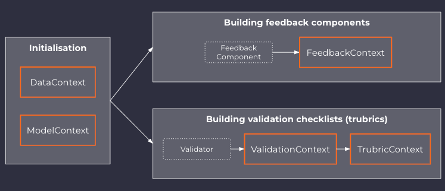

# Understanding contexts in trubrics
Contexts in the trubrics library refer to [Pydantic](https://pydantic-docs.helpmanual.io/) data models. The two main contexts that must be initialised before building a validations or a feedback component are the DataContext and the ModelContext.

## The DataContext
!!!example "DataContext Example"
    --8<-- "docs/snippets/init_datacontext.md"
:::trubrics.context.DataContext

## The ModelContext
!!!example "ModelContext Example"
    --8<-- "docs/snippets/init_modelcontext.md"
:::trubrics.context.ModelContext

## The TrubricsContext
!!!example "TrubricContext Example"
    --8<-- "docs/snippets/save_trubric.md"
:::trubrics.context.TrubricContext

???note "The ValidationContext"
    The ValidationContext is an intermediate context used to define the output of a trubrics validation.
    ValidationContexts are gathered into a list to define a trubric.

## The FeedbackContext
:::trubrics.context.FeedbackContext
