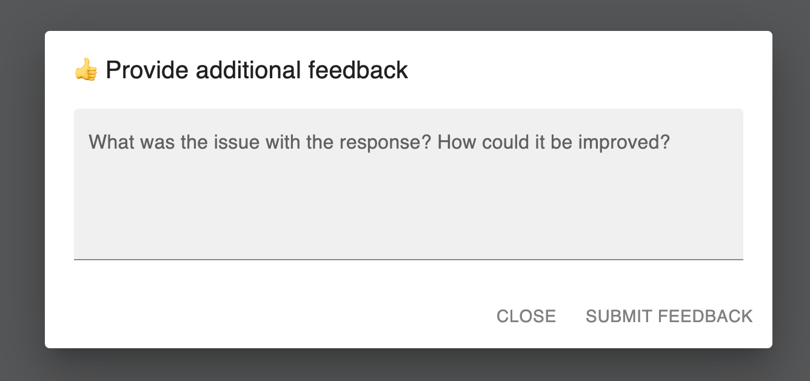

# React example with Trubrics

The following example shows how you can collect Trubrics feedback directly from your React.js application. We will be using React MUI components that displays thumbs up/down feedback buttons. Upon clicking, users will be able to provide extra additional feedback through a popup window.

## Setup

To get started, clone the [trubrics-sdk](https://github.com/trubrics/trubrics-sdk). Copy & rename `.env_example` to a `.env` file and add your Trubrics email, password, and a feedback component name. Use `REACT_APP_TRUBRICS_COMPONENT=default` if you haven't created a new feedback component yet.

## Run the example app

`npm start` runs the app in the development mode from the directory `examples/feedback/react_js`. Open [http://localhost:3000](http://localhost:3000) to view it in your browser.

The page will reload when you make changes. You may also see any lint errors in the console.

This project was bootstrapped with [Create React App](https://github.com/facebook/create-react-app).

## View the code

The React components can be seen [here](https://github.com/trubrics/trubrics-sdk/blob/main/examples/feedback/react_js).
