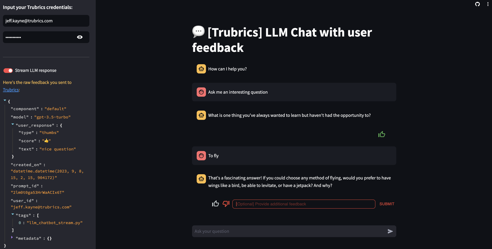

# FeedbackCollector Streamlit Integration
The FeedbackCollector takes user feedback from within an app and saves it to Trubrics.

## Install
To get started with [Streamlit](https://streamlit.io/), install the additional dependency:

```console
pip install "trubrics[streamlit]"
```

## Streamlit Example Apps
Once you have created an account with [Trubrics](https://trubrics.streamlit.app/), you can try our deployed example Streamlit apps that use the integration to save feedback:



- **LLM chat** - [deployed app](https://trubrics-llm-example-chatbot.streamlit.app/) | [code](https://github.com/trubrics/trubrics-sdk/blob/main/examples/streamlit/llm_chatbot.py) : A chatbot that queries OpenAI's API and allows users to leave feedback.
- **LLM single answer** - [deployed app](https://trubrics-llm-example.streamlit.app/) | [code](https://github.com/trubrics/trubrics-sdk/blob/main/examples/streamlit/llm_app.py) : An LLM app that queries OpenAI's API and allows users to leave feedback on single text generations.

The code for these apps can be viewed in the [trubrics-sdk](https://github.com/trubrics/trubrics-sdk/tree/main/examples), and may be run by cloning the repo and running:

=== "LLM chat"
    !!!tip OpenAI
        To run this app, you are required to have your own [OpenAI](https://platform.openai.com/overview) API key.

    Install openai:
    ```console
    pip install openai
    ```

    Then save your OpenAI API key with `OPENAI_API_KEY='your_openai_key'` in [st.secrets](https://blog.streamlit.io/secrets-in-sharing-apps/), and run:
    ```console
    streamlit run examples/feedback/streamlit/llm_chatbot.py
    ```

=== "LLM single answer"
    !!!tip OpenAI
        To run this app, you are required to have your own [OpenAI](https://platform.openai.com/overview) API key.

    Install openai:
    ```console
    pip install openai
    ```

    Then save your OpenAI API key with `OPENAI_API_KEY='your_openai_key'` in [st.secrets](https://blog.streamlit.io/secrets-in-sharing-apps/), and run:
    ```console
    streamlit run examples/feedback/streamlit/llm_app.py
    ```

## Add the FeedbackCollector to your App

Here is a complete example to log user prompts and feedback from a simple streamlit application:

```py title="examples/streamlit/basic_app.py"
import streamlit as st
from trubrics.integrations.streamlit import FeedbackCollector

if "logged_prompt" not in st.session_state:
    st.session_state.logged_prompt = None
if "feedback_key" not in st.session_state:
    st.session_state.feedback_key = 0

# 1. authenticate with trubrics
collector = FeedbackCollector(
    email=st.secrets.TRUBRICS_EMAIL,
    password=st.secrets.TRUBRICS_PASSWORD,
    project="default"
)

if st.button("Refresh"):
    st.session_state.feedback_key += 1
    st.session_state.logged_prompt = None
    st.experimental_rerun()

prompt = "Tell me a joke"
generation = "Why did the chicken cross the road? To get to the other side."
st.write(f"#### :orange[Example user prompt: {prompt}]")


if st.button("Generate response"):
    # 2. log a user prompt & model response
    st.session_state.logged_prompt = collector.log_prompt(
        config_model={"model": "gpt-3.5-turbo"},
        prompt=prompt,
        generation=generation,
    )

if st.session_state.logged_prompt:
    st.write(f"#### :blue[Example model generation: {generation}]")
    # 3. log some user feedback
    user_feedback = collector.st_feedback(
        component="default",
        feedback_type="thumbs",
        open_feedback_label="[Optional] Provide additional feedback",
        model=st.session_state.logged_prompt.config_model.model,
        prompt_id=st.session_state.logged_prompt.id,
        key=st.session_state.feedback_key,
        align="flex-start",
    )
```

What's going on here? Let's break down this snippet:

### 1. `FeedbackCollector()`

!!!tip
    The authentication token is cached already, but to optimise your app further, wrap the `FeedbackCollector` in [@st.cache_data](https://docs.streamlit.io/library/api-reference/performance/st.cache_data).

!!!note "FeedbackCollector object"
    :::trubrics.integrations.streamlit.FeedbackCollector.__init__

### 2. `collector.log_prompt()`

!!!note ".log_prompt() parameters"
    :::trubrics.Trubrics.log_prompt

### 3. `collector.st_feedback()`

!!!note ".st_feedback() parameters"
    :::trubrics.integrations.streamlit.FeedbackCollector.st_feedback
