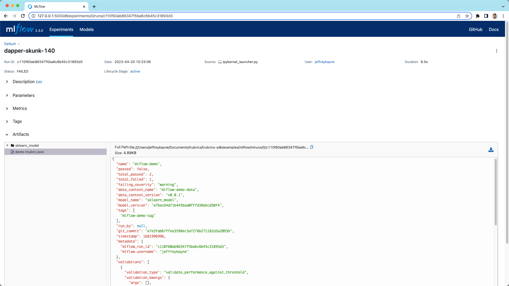

Trubrics has an official plugin with Mlflow's [`mlflow.evaluate()`](https://www.mlflow.org/docs/latest/python_api/mlflow.html#mlflow.evaluate) API. This allows users to validate models within an Mlflow run, saving all validation results. This plugin expands on the existing validation functionality within Mlflow's API:

- all model validation results can be viewed in a .json file, for diagnosis of why a run could have failed
- a large number of [out-of-the-box](./validations.md) validations 
- ability to validate a run with your own [custom](./custom_validations.md) logic
- ability to [customise the data](./data_context.md) to validate (with data validations, for example)



## Install plugin
(venv)$ pip install "trubrics[mlflow]"

## Example notebook
To dive straight in, clone the repo and run the [example notebook](). This example shows both a basic validation and a slightly more advanced set of validations within an Mlflow run.

## Plugin parameters
To get started with Trubrics & Mlflow, you must first [build some validations](./index.md#validate-a-model-with-the-modelvalidator). Once you have built some validations and saved them as a .json file, you are ready to insert this snippet and start validating directly in your Mlflow run:

```py
model = <your_model>
eval_data = <your_eval_pandas_df>
target = "variable_name_in_eval_data_to_predict"
trubric_path = "path_to_trubric.json"

with mlflow.start_run() as run:
    model_uri = mlflow.sklearn.log_model(model, "sklearn_model").model_uri

    mlflow.evaluate(
        model=model_uri,
        model_type="classifier",
        data=eval_data,
        targets=target,
        evaluators="trubrics",
        evaluator_config={
            "trubric_path": trubric_path, "model": model
        }
    )
```

There are two arguments in `mlflow.evaluate()` that control how you use Trubrics:

- `evaluators="trubrics"`: this instructs that you are using the trubrics plugin as the evaluator
- [`evaluator_config={}`](#evaluator_config): this is where you save all configuration for validations

### `evaluator_config`
There are two required parameters in the `evaluator_config`:

- `trubrics_path`: a Trubric .json file of validations
- `model`: your ML model (see [compatible models](./models.md) with Trubrics)


For a more advanced example of how you can customise the Trubrics evaluator, add more parameters into the `evaluator_config`:

- `data_context`: specifying a `data_context` allows users to build validations on not just evaluation data, but also on your training data. This can be useful for validating if your model is overfitting, or if your training data and testing data follow similar distributions for example.
- `failing_severity`: this allows you to change the severity that you would like the Trubric to fail on. Setting `failing_severity="warning"` means that any validation failure with a severity of "warning" or "error" will result in an overall failure of the Trubric and will raise an exception. The default behaviour is `failing_severity="error"`, meaning only validation failures with `severity="error"` will raise an exception.
- `tags`: any tags that you want to save to your Trubric (separate from MLFlow tags).
- `slicing_functions`: slicing functions in Trubrics allow you to validate your model performance on different data slices. See more [here](./metrics.md#3-data-slicing-functions).

To unlock the full power of Trubrics, you should look at building custom validations for your model. Read more about this [here](./custom_validations.md).
