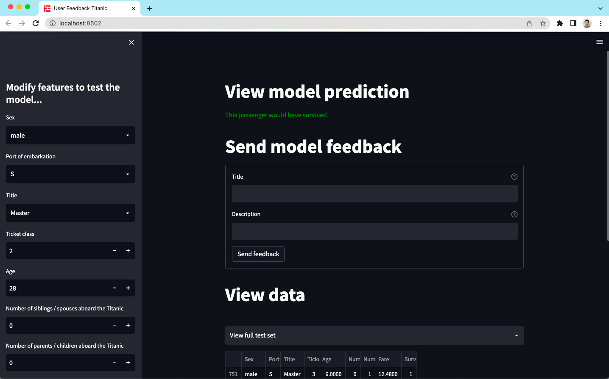
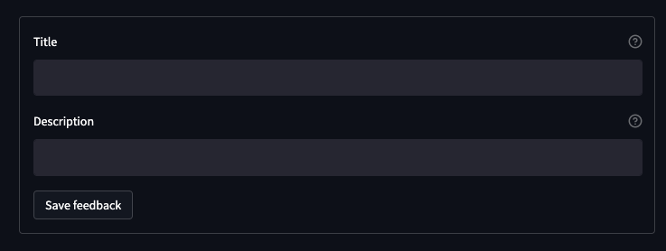
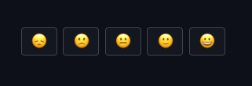
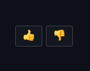
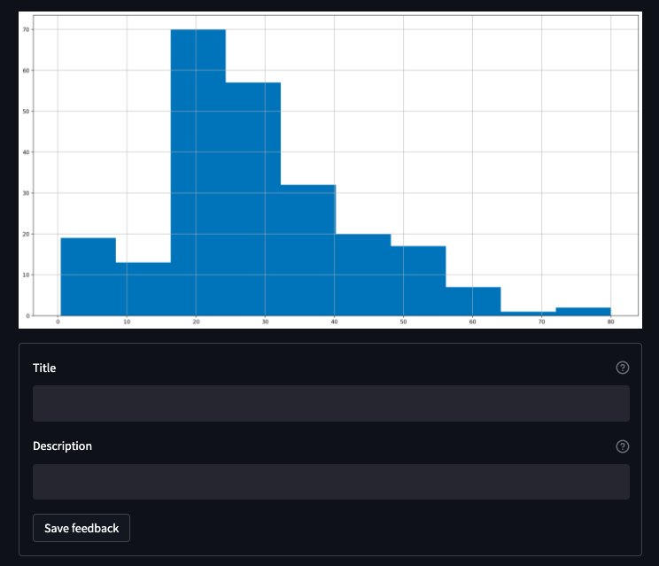

# FeedbackCollector Streamlit Integration
The FeedbackCollector takes user feedback from within an app, and saves it as a .json file or directly to the Trubrics platform.

## 1. Install the Streamlit integration
To get started with [Streamlit](https://streamlit.io/), install the additional dependency:

```console
(venv)$ pip install "trubrics[streamlit]"
```

## 2. Launch our demo application from CLI
- Run our demo Streamlit app without authentication:
    ```console
    (venv)$ trubrics example-app
    ```
  
- Run our demo Streamlit app with authentication to the Trubrics platform:
    ```console
    (venv)$ trubrics example-app --trubrics-platform-auth multiple_users
    ```

    !!!tip "Trubrics platform access"
        The Trubrics platform will allow you to track all issues, and discuss errors with users and other collaborators. There are also capabilities to close feedback issues by linking to specific validation runs. Creating accounts for users will also allow authentication directly in the FeedbackCollector. Don't hesitate to get in touch with us [here](https://trubrics.com/demo/) to gain access for you and your team.

    
    <p align="center"><em>Our demo Streamlit app with authentication to the Trubrics platform</em></p>


## 3. Add the FeedbackCollector to your App
To get started with the bare bones code, you can add this code snippet to your app:
```py
from trubrics.integrations.streamlit import FeedbackCollector

collector = FeedbackCollector()
collector.st_feedback(type="issue")
```

We can breakdown this snippet in to:

1. The [FeedbackCollector](#feedbackcollector) object that holds metadata (about datasets, models and authentication)
2. Its [st_feeedback()](#st_feedback) method that allows users to collect different types of feedback

!!!Note
    A second method [st_trubrics_auth()](#st_trubrics_auth) also exists, allowing users to authenticate with the Trubrics platform.

### FeedbackCollector()

All static metadata for the app that is not dependant on the actual feedback component can be included in the FeedbackCollector upon initialisation. Here's an example of how you can use it with the [DataContext](./data_context.md), allowing you to harmonise the data assets between your training / validation runs and your ML apps:

```py
from trubrics.context import DataContext
from trubrics.example import get_titanic_data_and_model
from trubrics.integrations.streamlit import FeedbackCollector

_, test_df, model = get_titanic_data_and_model()

# 1. Init DataContext
data_context = DataContext(
    testing_data=test_df,  # pandas dataframe that model was tested on
    target="Survived",
)

# 2. Init FeedbackCollector
collector = FeedbackCollector(
    data_context=data_context,
    model_name="titanic_rf",
    model_version="v1",
    trubrics_platform_auth=None
)
```

!!!tip "FeedbackCollector object"
    :::trubrics.integrations.streamlit.FeedbackCollector.__init__

!!!Note
    For more information on authentication options and the `trubrics_platform_auth` attribute, see [st_trubrics_auth()](#st_trubrics_auth).

### .st_feedback()
Once the FeedbackCollector created, the .st_feedback() method is used to actually add feedback visual components to your app.

!!!tip ".st_feedback() parameters"
    :::trubrics.integrations.streamlit.FeedbackCollector.st_feedback

#### Feedback types
- `type="issue"`:
  
  {: style="width:70%"}

- `type="faces"`

  {: style="width:50%"}

- `type="thumbs"`

  {: style="width:20%"}

#### Metadata
You can use the metadata argument to track specific data within your app, for example to be able to recreate the figure that your users are viewing:

```py
# save metadata of a specific component
st.pyplot(test_df["Age"].hist(figsize=(20, 10)).figure)
collector.st_feedback(type="issue", metadata={"age": test_df["Age"].to_list()})
```

{: style="width:70%"}

#### Feedback data
Using `.st_feedback(path="./your_path/filename.json")` you can configure the path for each feedback to be saved to. The .json holds the following fields:

!!!tip "Feedback data object"
    :::trubrics.feedback.dataclass.Feedback


### .st_trubrics_auth()
To authenticate with the Trubrics platform, you must first run a [`trubrics init`](./trubrics_cli.md#2-connect-to-the-trubrics-platform-with-trubrics-init) before launching your app.

You then have two options for saving feedback:

  1. `trubrics_platform_auth="single_user"`
     
    This allows users to add their feedback, but using the app owners credentials (that have been set with a `trubrics init`). Should you want to pass user information, you can always use the [`metadata`](#metadata) parameter of .st_feedback().

  2. `trubrics_platform_auth="multiple_users"`
     
    With this you can add full user authentication to within your streamlit application. Any user who has access to the Trubrics platform therefore can equally use their login details to login and start giving feedback.

    Here's an example of how you can add full user authentication to your app:

    ```py
    import streamlit as st
    from trubrics.integrations.streamlit import FeedbackCollector

    @st.cache
    def trubrics_init():
        return FeedbackCollector(trubrics_platform_auth="multiple_users")

    collector = trubrics_init()

    with st.sidebar:
        collector.st_trubrics_auth()

    collector.st_feedback(type="issue")
    ```

    !!!Note
        As streamlit refreshes your app on each interaction, make use of st.cache to save authentication information for the session.
